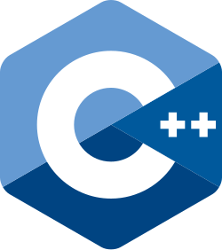
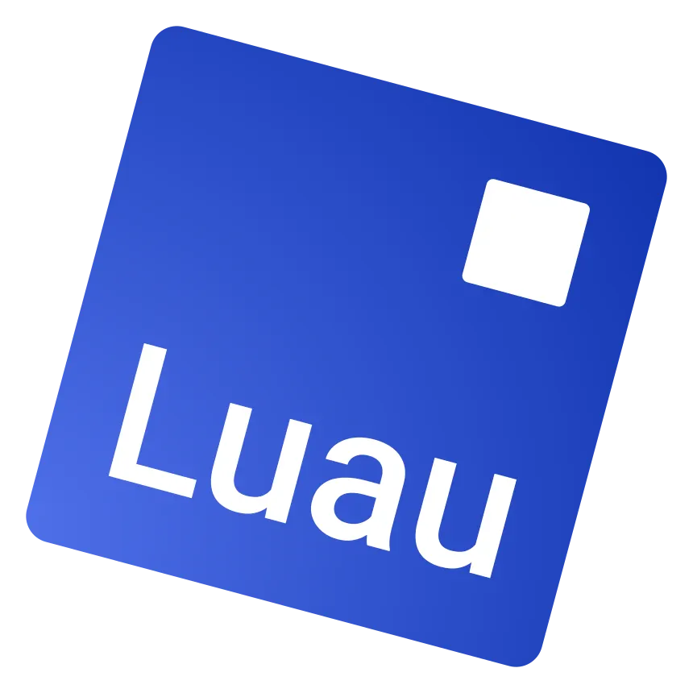

## 👨‍💻 About Me
Hello there! I'm **Hilmi**, an aspiring **AI Engineer** and **Graphics Programmer**. Currently exploring **OpenGL**, **GLSL**, and **C++** for building the important basic foundation inside **Graphics Programming**. ⚒️🤖

## ⚙️ Used Programming/Scripting Language

  

  

🌱 I’m currently learning OpenGL, and C++.
🔭 I’m currently working on Rogue Engine, a custom game engine I am building.
<!--
**devilhandler/devilhandler** is a ✨ _special_ ✨ repository because its `README.md` (this file) appears on your GitHub profile.

Here are some ideas to get you started:

- 🔭 I’m currently working on ...
- 🌱 I’m currently learning ...
- 👯 I’m looking to collaborate on ...
- 🤔 I’m looking for help with ...
- 💬 Ask me about ...
- 📫 How to reach me: ...
- 😄 Pronouns: ...
- ⚡ Fun fact: ...
-->
